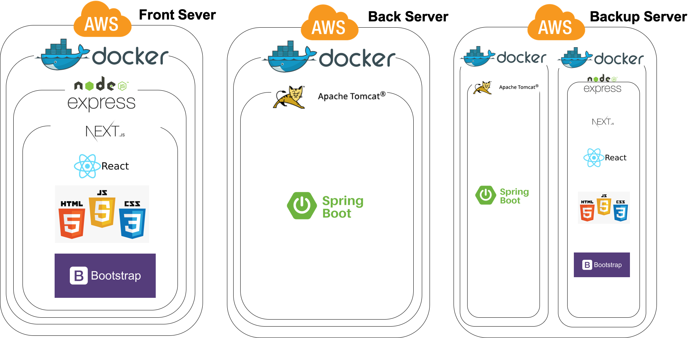

# Hedge Manager
환 리스크 관리를 위한 최적의 전략 추천

## 시스템 아키텍처
### 구조도


### 데이터 흐름도


## 프론트엔드 실행 방법
```
git clone https://github.com/SeunghyeonYu/hedge_project.git
cd hedge_project/
npm install --save
npm run dev
```

### 버전 문제 발생시 next 버전 수정 시
```
npm remove next && npm i next@9.3.3
```

## 벡엔드 실행 방법
```
git clone https://github.com/SeunghyeonYu/hedge_project.git
cd hedge_project/
chmod +x mvnw
./mvnw install
cd /target
java -jar hedge-0.0.1-SNAPSHOT.jar

```
## 개발 및 기여자

* 우이레
* 유승현
* 이도현
